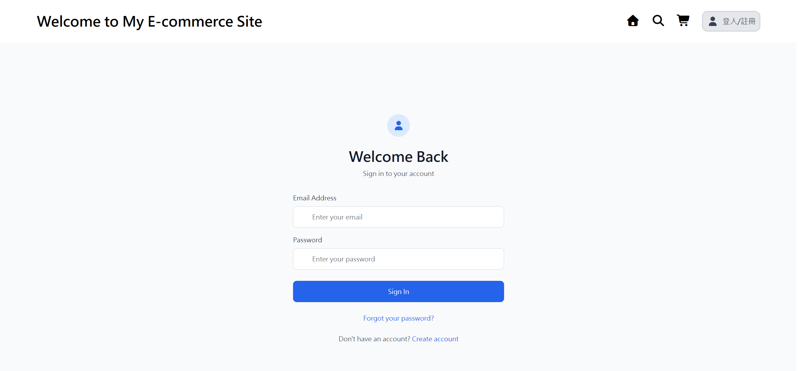
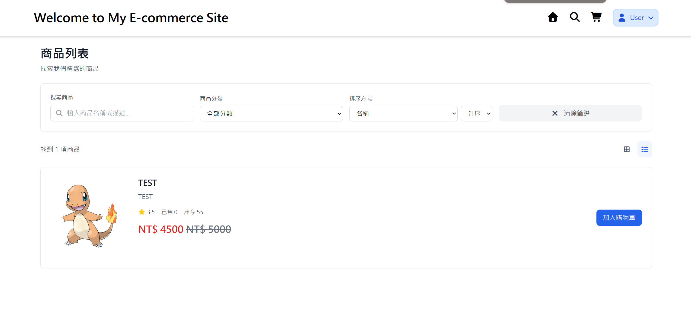
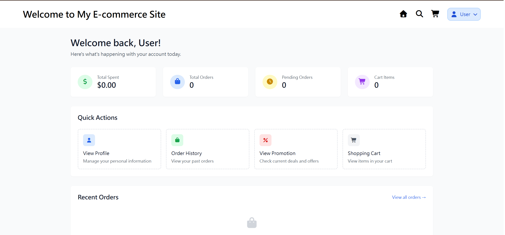
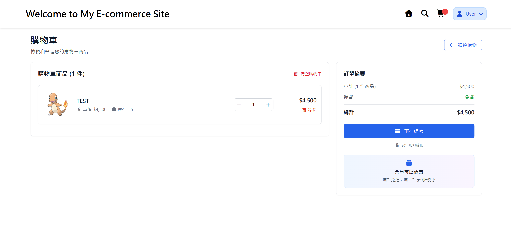
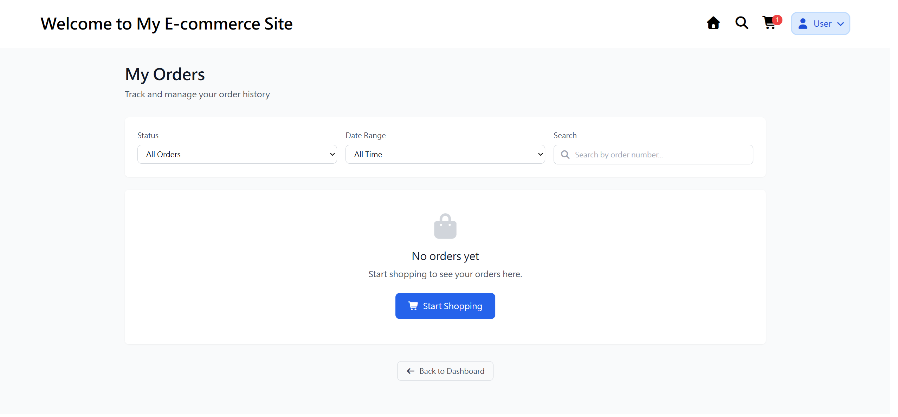

# E-Commerce Platform (Vue 3 + Vite)

這是一個基於 Vue 3 和 Vite 的電商平台前端專案，結合 TailwindCSS 提供高效能、響應式的使用者介面。專案採用前後端分離架構，後端使用 Spring Boot，並整合 PostgreSQL 資料庫。

---
## 🌐 Live Demo

- 前端：**https://weirong.site**

> ⚠️ 注意  
> - 目前使用 ECPay 測試環境；付款流程僅示範，不會有實際金流。
> - 伺服器在免費/低配環境，**首次載入可能較慢**（cold start）。  

### Screenshots







---
## 🛠 技術架構

- **前端**：Vue 3、Vite、TailwindCSS
- **後端**：Spring Boot、PostgreSQL、JWT
- **版本控制**：Git + GitHub

---

## 📂 專案結構

```plaintext
.env.development       # 開發環境變數
src/                   # 前端程式碼
  ├── assets/          # 靜態資源
  ├── components/      # Vue 元件
  ├── views/           # 頁面
  ├── services/        # API 呼叫邏輯
  ├── stores/          # 狀態管理 (Pinia)
  └── router/          # 路由設定
public/                # 公共資源 (favicon, HTML 模板)
ecommerce-docs/        # 設計文件 (API 規格, 資料庫結構)
```

---

## 🛍 功能模組

- **使用者模組**：註冊、登入、個人資訊管理
- **商品模組**：商品列表、詳情、搜尋與分類
- **活動模組**：促銷活動展示
- **購物車模組**：商品加入/移除、數量修改
- **訂單模組**：建立訂單、查詢訂單狀態
- **支付模組**：整合綠界 ECPay，模擬付款與交易狀態更新
- **管理後台模組**：商品、訂單、使用者與活動管理

---

## 🚀 快速開始

### 安裝依賴
```bash
npm install
```

### 啟動開發伺服器
```bash
npm run dev
```

### 打包專案
```bash
npm run build
```

---

## 🔧 環境變數設定
請在專案根目錄建立 .env 檔案，並設定以下變數：
```
VITE_API_URL=https://api.weirong.site
```

---

## 📑 文件參考

| 文件類型       | 位置                          |
|----------------|-------------------------------|
| API 規格       | [docs/api-spec.yaml](ecommerce-docs/docs/api-spec.yaml) |
| 資料庫 Schema  | [docs/database-schema.sql](ecommerce-docs/docs/database-schema.sql) |
| ER 圖          | [docs/er-diagram.puml](ecommerce-docs/docs/er-diagram.puml) |

---
