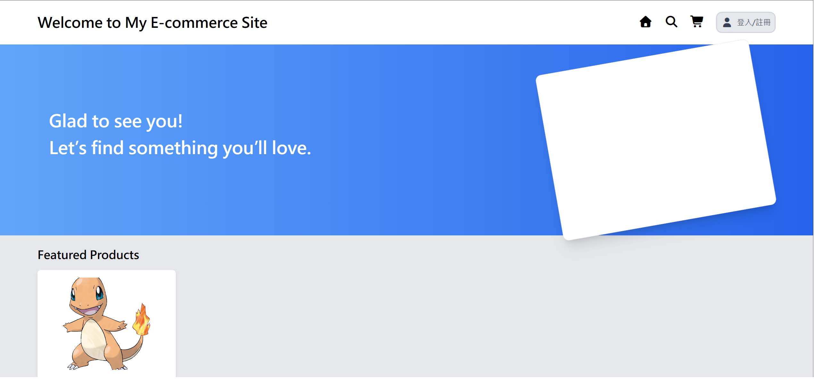

# E-Commerce Platform (Vue 3 + Vite)

這是一個基於 Vue 3 和 Vite 的電商平台前端專案，結合 TailwindCSS 提供高效能、響應式的使用者介面。專案採用前後端分離架構，後端使用 Spring Boot，並整合 PostgreSQL 資料庫。

---
## 🌐 Live Demo

- 前端：**https://weirong.site**

> ⚠️ 注意  
> - 目前使用 ECPay 測試環境；付款流程僅示範，不會有實際金流。
> - 伺服器在免費/低配環境，**首次載入可能較慢**（cold start）。  

### Screenshots



---
## 🛠 技術架構

- **前端**：Vue 3、Vite、TailwindCSS
- **後端**：Spring Boot、PostgreSQL、JWT
- **版本控制**：Git + GitHub

---

## 🚀 快速開始

### 安裝依賴
```bash
npm install
```

### 啟動開發伺服器
```bash
npm run dev
```

### 打包專案
```bash
npm run build
```

---

## 🔧 環境變數設定
請在專案根目錄建立 .env 檔案，並設定以下變數：
```
VITE_API_URL=https://api.weirong.site
```

