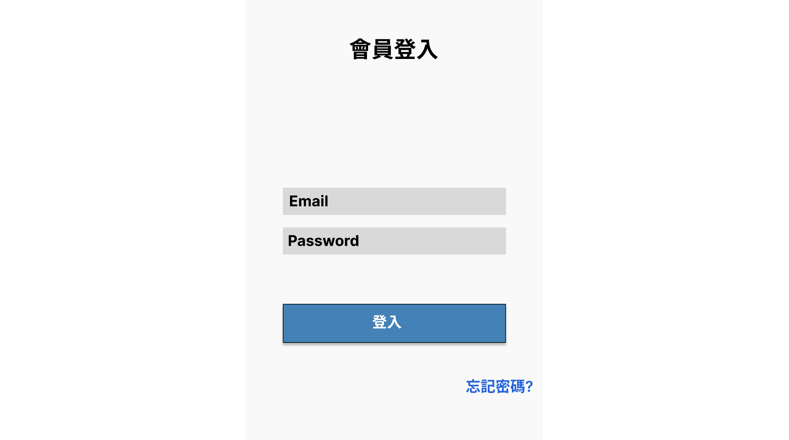

# Login

## UI

## 目的

進行會員登入

## Layout

- 主區塊：置中顯示，寬度 480px
- 表單區塊（Form）：

  - 標題：「會員登入」
  - 欄位：
    - Email（輸入框，placeholder: "請輸入 Email"）
    - Password（輸入框，type=password，placeholder: "請輸入密碼"）
  - [登入] 按鈕（primary）
  - [忘記密碼] 連結（在表單下方，靠右）

- 錯誤訊息：欄位下方顯示錯誤提示
- Loading 狀態：按鈕呈現 loading 動畫
- 成功登入：導向首頁 `/home`

## 欄位

| 欄位名稱 | 型態     | 必填 | 驗證       | 說明               |
| -------- | -------- | ---- | ---------- | ------------------ |
| Email    | text     | 是   | Email 格式 | 使用者登入的 Email |
| Password | password | 是   | 長度 >= 6  | 使用者登入密碼     |

## 互動

- 點擊[登入] -> 登入成功跳轉至首頁 -> 失敗則顯示錯誤訊息
- 點擊[忘記密碼] -> 跳轉至忘記密碼頁面

## API

- POST /users/login 會員登入

## 響應式設計

- 手機版：表單寬度 100%，間距縮小，按鈕橫向全寬
- 桌機版：表單置中，寬度固定320px

## 補充

- 背景色：#f5f5f5
- 表單外有簡單陰影

## 權限

- Guest 訪客都可以使用
